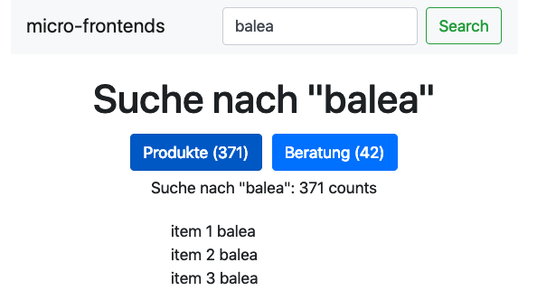

# WIP: micro-frontends
!!! This repo is still work in progress, do not use it yet

example repo for micro frontends with react and dependency inversion as integration pattern

playground to learn how to integrate micro frontends, usages product and content search as example

Assume you have two ore more different search providers as e.g. product and content search. Both are
developed in different teams which want to develop and release their features independently. But you
have to integrate them in frontend like the following:



## Why?
To scale with multiple teams in a micro services environment

* Keep coupling low
* One-Way dependency graph
* Specialised assets know general assets, but not vice versa

## Set up
````
yarn build

cd composer
yarn serve

cd search
yarn serve

cd product
yarn serve

cd content
yarn serve
````

Open http://localhost:8080 in web browser

## Model

## Project structure

````
.
├── composer
│   ├── client
│   └── server
├── content
│   ├── client
│   └── server
├── product
│   ├── client
│   └── server
├── search
│   ├── client
│   └── server
└── search-api
    ├── lib
    └── src
    
````

### search-api
interface to register different search providers with

* ID
* order
* execute_search
* execute_count
* getSearchTab
* getResultComponent

### search

* client
** provides container stuff, like rendering search tabs or search results
** calls search callback on active search provider
** handles search errors, search fallback and merges suggestions from all search providers

* server
** delivers client js, could be a CDN as well

### product, content

* client
** provides components to render search results and search tabs
** could implement filter and use fetchData callback to re-execute search

* server
** delivers client js, could be a CDN as well

### composer

* server
** central unit that receives browser request and return html document
** includes all scripts
** may or may not fetch initial data and could be used for server side rendering


## Slides
Uses [demoit](https://github.com/dgageot/demoit "demoit") and Go

1. Install [Go](https://golang.org/ "Go")
2. Start with ./demoit demo

## ToDos
### Store/Hooks
1. remove @dm/store libs
2. use scoped packages and updates libs or introduce react hooks
### Start all Server
### README.md
workflow durch den Code
write README.md
### error handling
add example and test it
### layout
optimization, evt. remove react-bootstrap
